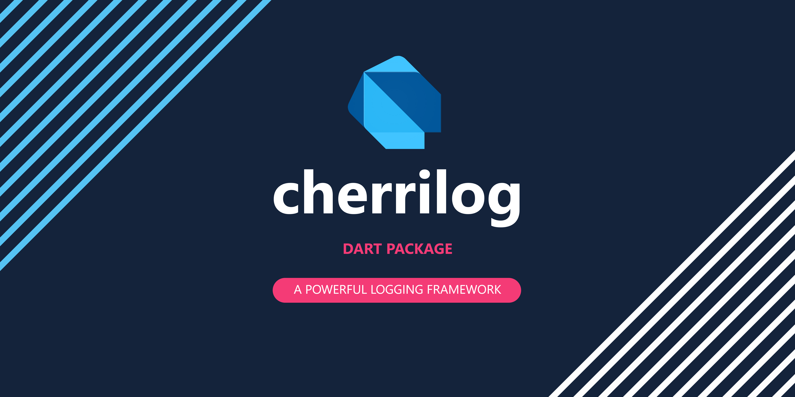

# CherriLog

CherriLog is perhaps the simplest and most useful log library for dart

## Overview

CherriLog is a simple and useful log library for dart. It is easy to use and can be costumized to your needs.

## Features

- Log messages directly by calling the method directly.  
- Direct output to console with different colors.  
- Nice stacktrace output.  
- *[In Progress]* Log to file. (Program Full Platform Support)  
- *[In Progress]* Highly customizable log format.  
- Log levels support.

## Usage

1. Add the dependency to your `pubspec.yaml` file. Recommended command line.

With Flutter
```bash
flutter pub add cherrilog
```

With Dart
```bash
dart pub add cherrilog
```

2. Import the library in your code.

```dart
import 'package:cherrilog/cherrilog.dart';
```

3. Initialize the logger.

```dart
CherriLog.init(
  options: CherriOptions()
    ..maximumLevel = CherriLogLevel.all
    ..minimumLevel = CherriLogLevel.off
    ..timeStampPattern = CherriFormatterTimeStampPattern.standardLongDateTime
    ..useBuffer = false,
).logTo(CherriConsole());
```

4. Use the logger.

```dart
info('This is an info message');
warning('This is a warning message');
error('Something went wrong');
```

## Configuration

The class `CherriOptions` contains all the configuration options for the logger.
- `CherriLogLevel maximumLevel`: The maximum log level to be displayed. Default is `CherriLogLevel.warning`.
- `CherriLogLevel minimumLevel`: The minimum log level to be displayed. Default is `CherriLogLevel.all`.
- `String timeStampPattern`: The pattern to be used for the timestamp. Default is `CherriFormatterTimeStampPattern.standardLongDateTime`.
- `bool useBuffer`: If `true`, the logs will be buffered and only displayed when the buffer is full. Default is `true`.
- `int bufferLineLength`: The number of lines to be buffered before displaying them. Default is `30`.
- `Duration flushInterval`: The interval to flush the buffer. Default is `const Duration(milliseconds: 500)`.

### Log Levels

The log levels are defined in the `CherriLogLevel` enum.  
Ranking of importance from highest to lowest.

- `CherriLogLevel.all`: All log levels. You should NOT use this loglevel when logging messages.
- `CherriLogLevel.fatal`: Fatal errors.
- `CherriLogLevel.error`: Errors.
- `CherriLogLevel.warning`: Warnings.
- `CherriLogLevel.info`: Informational messages.
- `CherriLogLevel.debug`: Debug messages.
- `CherriLogLevel.off`: No log messages. You should NOT use this loglevel when logging messages.

### timeStampPattern

We offer some preset formats. You can also create your own format.  
You can see `formatter/timestamp.dart` for more information.

## Customization

*TODO*

## Output

<pre>
<span style="color: #2472C8">[2024-04-13 18:07:28] [DBG] You are doing something right</span>
<span style="color: #0DBC79">[2024-04-13 18:07:28] [INF] You are doing something</span>
<span style="color: #E5E510">[2024-04-13 18:07:28] [WRN] You are doing something wrong</span>
<span style="color: #CD3131">[2024-04-13 18:07:28] [ERR] You can not shutdown power</span>
<span style="color: #F14C4C">[2024-04-13 18:07:28] [FTL] The power is off</span>
</pre>

*Note: The colors may vary depending on the terminal. This is probably the result on VSCode. [Reference](https://en.wikipedia.org/wiki/ANSI_escape_code#3-bit_and_4-bit)*
